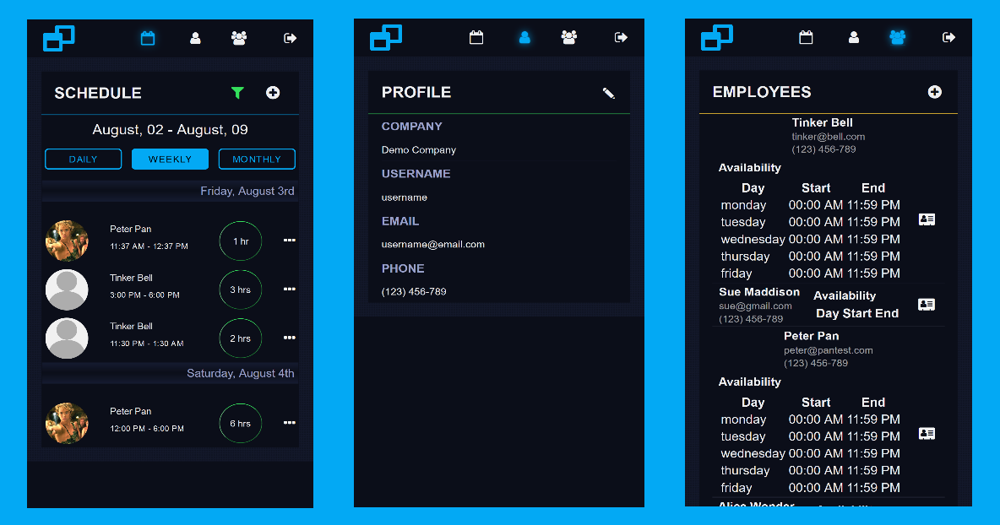

 [Frames](https://frames-client.netlify.com/) - staff scheduling app
============================
Small, intuitive, and easy to use staff scheduling application for small businesses. 
When scheduling for multiple shifts, multiple employees over multiple divergent time zones, 
Frames steps in to take out the leg work. Users can easily add, assign, edit and delete shifts, 
maintain a list of employees and contact information and keep their schedules straight in daily, 
weekly or monthly views.

Live demo can be viewed [here](https://frames-client.netlify.com/).

Demo account for testing:

username: username

password: password

## Screenshots



## Installation
Clone the GitHub repository and use [NPM](https://www.npmjs.com/) to install project dependencies.
```$xslt
$ git clone https://github.com/thinkful-ei20/frames-client.git
$ cd frames-client
$ npm install
```

## Tech Stack
* [create-react-app](https://github.com/facebook/create-react-app)
* [React](https://reactjs.org/)
* [Redux](https://redux.js.org/)
* [jwt-decode](https://www.npmjs.com/package/jwt-decode)

## Authors
* [Cameron Prier](https://github.com/Csprier)
* [Marina Dargitz](https://github.com/mdargitz)
* [Marina Valiquette](https://github.com/Sakela17)
* [Gianluca Paterson](https://github.com/patersog)


